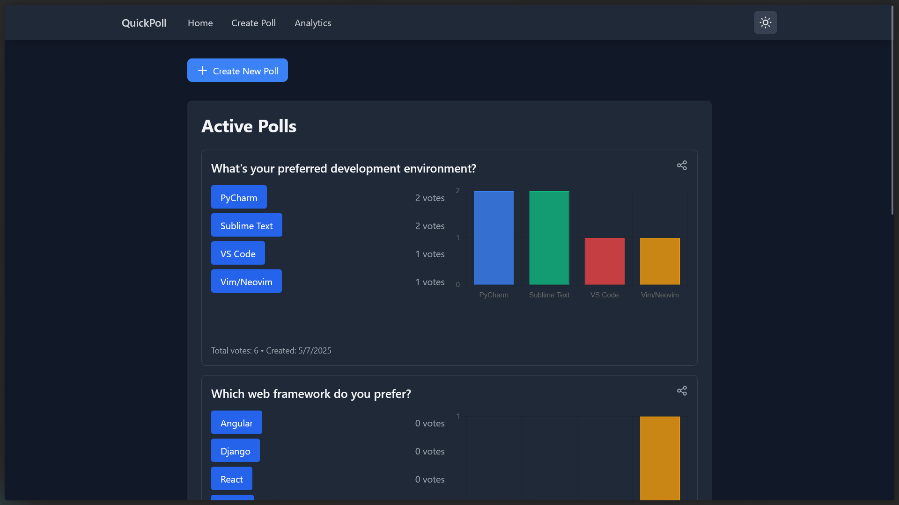
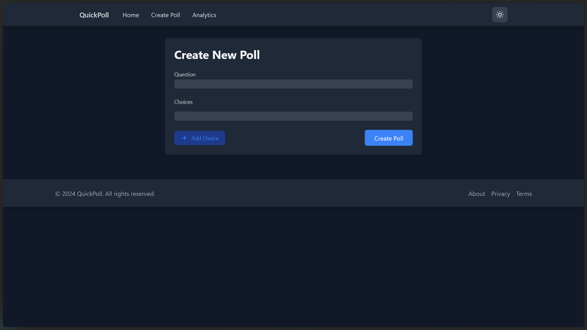
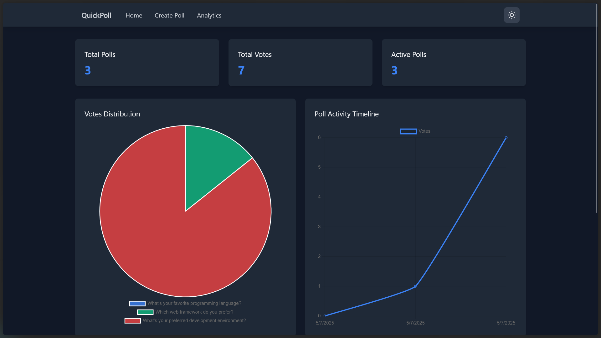

# QuickPoll

A modern, real-time polling application built with Django and jQuery, featuring data visualization and analytics.

## Features

### Core Functionality
- Real-time poll creation and voting
- Dynamic updates without page refresh
- Mobile-responsive design
- Dark mode support
- Share polls via URL

### Data Visualization
- Interactive bar charts for poll results
- Pie charts for vote distribution
- Activity timeline charts
- Real-time statistics dashboard

### Analytics Dashboard
- Total polls and votes overview
- Active polls tracking
- Detailed poll statistics
- Vote distribution analysis
- Activity timeline visualization

### Technical Features
- RESTful API architecture
- Real-time data updates using AJAX
- Responsive UI with Tailwind CSS
- Data visualization with Chart.js
- Modern JavaScript practices
- Mobile-first design approach

## Screenshots

### Main Dashboard

*The main dashboard showing active polls with real-time vote counts and charts*

### Poll Creation

*Dynamic poll creation form with add/remove choice fields*

### Analytics View

*Comprehensive analytics dashboard with charts and statistics*

### Dark Mode

*Application in dark mode with system preference detection*

### Mobile View

*Responsive design optimized for mobile devices*

## Tech Stack

- **Backend**: Django, Django REST Framework
- **Frontend**: jQuery, Tailwind CSS, Chart.js
- **Database**: SQLite (default), supports PostgreSQL
- **Real-time Updates**: AJAX polling
- **Data Visualization**: Chart.js
- **Styling**: Tailwind CSS

## Installation

1. Clone the repository:
```bash
git clone https://github.com/yourusername/quick-poll.git
cd quick-poll
```

2. Create and activate a virtual environment:
```bash
python -m venv venv
source venv/bin/activate  # On Windows: venv\Scripts\activate
```

3. Install dependencies:
```bash
pip install -r requirements.txt
```

4. Run migrations:
```bash
python manage.py migrate
```

5. Create a superuser:
```bash
python manage.py createsuperuser
```

6. Run the development server:
```bash
python manage.py runserver
```

## Usage

1. Access the application at `http://127.0.0.1:8000/`
2. Create polls at `http://127.0.0.1:8000/create/`
3. View analytics at `http://127.0.0.1:8000/analytics/`
4. Access admin interface at `http://127.0.0.1:8000/admin/`

## API Endpoints

- `GET /api/polls/` - List all polls
- `POST /api/polls/` - Create a new poll
- `POST /api/polls/{id}/vote/` - Vote on a poll
- `GET /api/polls/analytics/` - Get analytics data

## Features in Detail

### Poll Creation
- Dynamic form with add/remove choice fields
- Real-time validation
- Automatic redirection after creation

### Voting System
- One-click voting
- Real-time vote count updates
- Vote confirmation feedback

### Analytics Dashboard
- Overview cards with key metrics
- Interactive charts and graphs
- Detailed statistics table
- Auto-refreshing data

### Dark Mode
- System preference detection
- Manual toggle option
- Persistent preference storage
- Smooth transitions

### Mobile Responsiveness
- Responsive navigation
- Adaptive layouts
- Touch-friendly interfaces
- Optimized for all screen sizes

## Contributing

1. Fork the repository
2. Create a feature branch
3. Commit your changes
4. Push to the branch
5. Create a Pull Request

## License

This project is licensed under the MIT License - see the LICENSE file for details.

## Acknowledgments

- Django REST Framework for the API
- Tailwind CSS for styling
- Chart.js for data visualization
- jQuery for DOM manipulation 